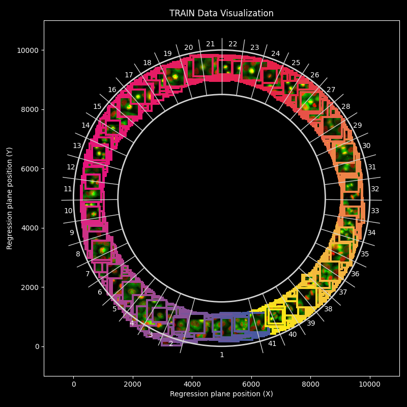
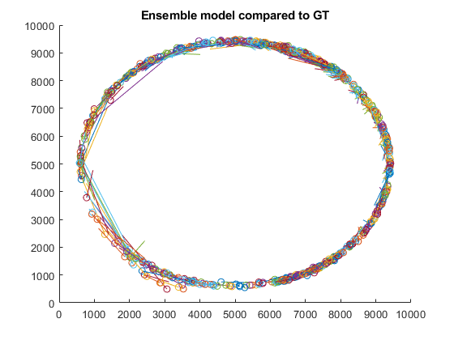

# Deep Regression Plane (Python Edition)

This repository contains the Python implementation of the Deep Regression Plane project, adapted from its original MATLAB version.

python3.10, torch


## Data representation

In the article, the data is represented on a circle centered at (5000, 5000). Interphase cells are located at 270° ± 15°. The remaining 330° is divided into 40 equal sections, each spanning 8.25°. The phases follow a clockwise (CW) order: Prophase → Prometaphase → Metaphase → Anaphase → Telophase.

See the figure below:


However, in the labels file, Interphase is positioned at 0°–30°, and the remaining phases are arranged in a counterclockwise (CCW) direction from 30° to 360°.

These differences are accounted for in regression_plane_utils.py.


## Data Preparation

### 1. Download Dataset

### DRP Raw data<br>
Preparation required, please run the scripts written in Dataset Preparation section<br>
https://doi.org/10.5281/zenodo.13896968 <br>

### Prepared dataset
Doesnet require to run dataset preparation section. This dataset is splitted and augmented training data:<br> https://doi.org/10.5281/zenodo.14945967 <br>


### 2. Convert Annotations
Once downloaded, the dataset must be converted to JSON format using the `convert_annotation.py` script.

### 3. Directory Structure
Ensure the dataset is organized in the following structure:

```
/storage01/grexai/datasets/Regplane_data/2022_v1_zeroPadded_split_with_test/
├── trainBalAug_v2_2/
│   ├── images/
│   ├── labels/
│   ├── labels2/  # Generated JSON annotations
├── val/
│   ├── images/
│   ├── labels/
│   ├── labels2/
├── test/
│   ├── images/
│   ├── labels/
│   ├── labels2/
```

### 4. Processing Annotations
Each TIFF label file contains coordinate information, which is extracted and rotated 90° counterclockwise around the point `(5000, 5000)` to match with the article. The processed coordinates are then saved as JSON files in the `labels2/` directory.

---

## Model Training

The training pipeline is implemented in PyTorch and supports multiple architectures:

- **InceptionV3**  
- **ResNet**

Both models are trained on the preprocessed dataset.

---

## Usage

### 1. Export Data from BIAS Software
The dataset should be exported in `ACC` format.

### 2. Run Predictions
Use `predict_for_BIAS.py` to perform inference:

- Reads the input images
- Generates crops and converts them into batches
- Loads an ensemble model (ResNet and InceptionV3)
- Runs ensemble predictions
- Filters predictions where `radius > 3500`

---
### Results

Torch model were trained with L1 loss multiple epochs see train_inceptionv3.py

The original model were trained with descripted hyperparameters in the article
#### Torch model on test set <u>RMSE 360</u> vs the original MATLAB modell on test set <u>RMSE ~670</u>



## Citations

This work builds upon previous research and tools developed for deep regression analysis of biological images.
